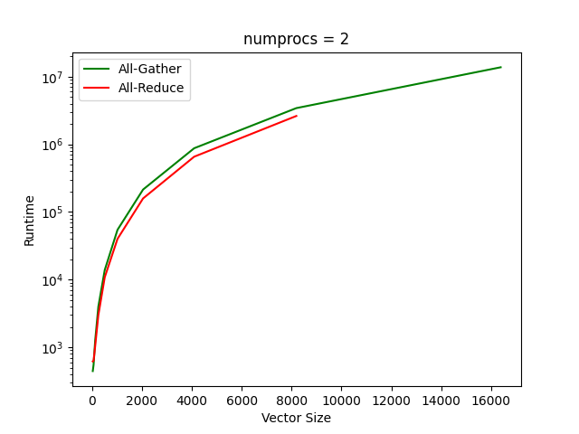
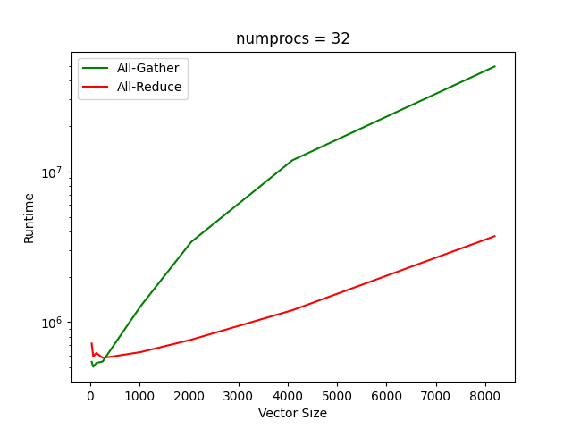
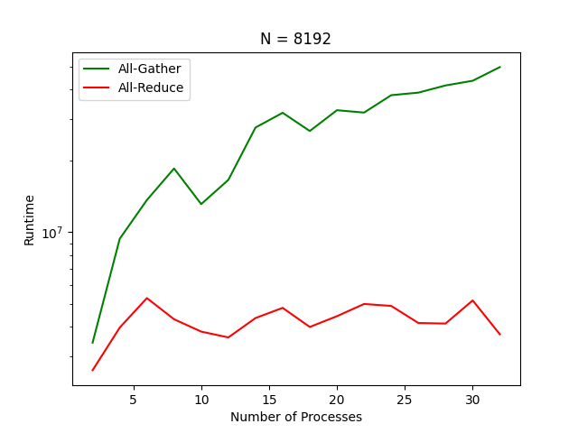
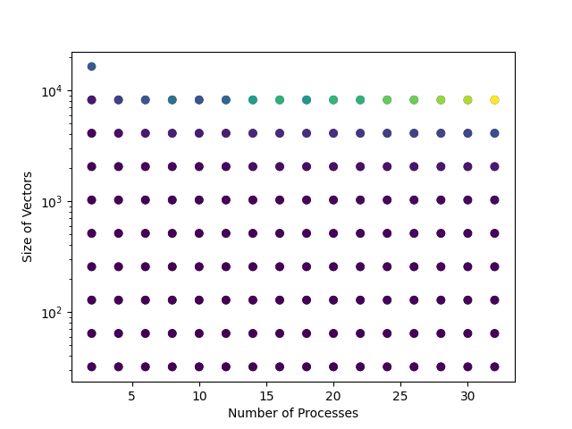
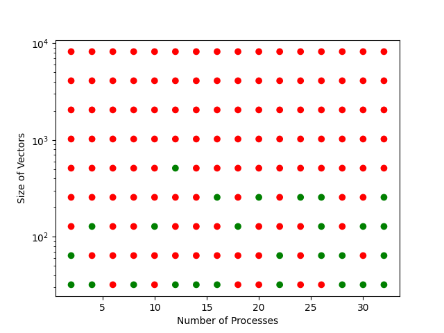

# Results

# What is this folder

This folder will contain, as its name suggests, some results - both raw job outputs and generated plots etc.

When running a benchmark, the files will be placed into the folder `tmp` in this directory, which is ignored by git. If
there are some nice results, rename this folder and track it using git.
